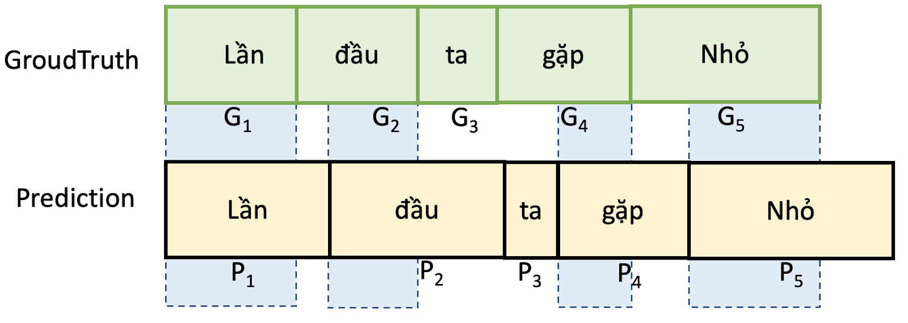
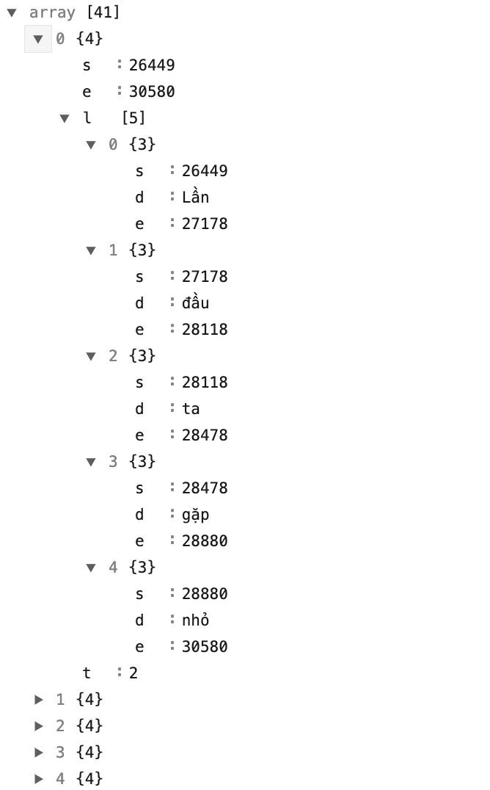
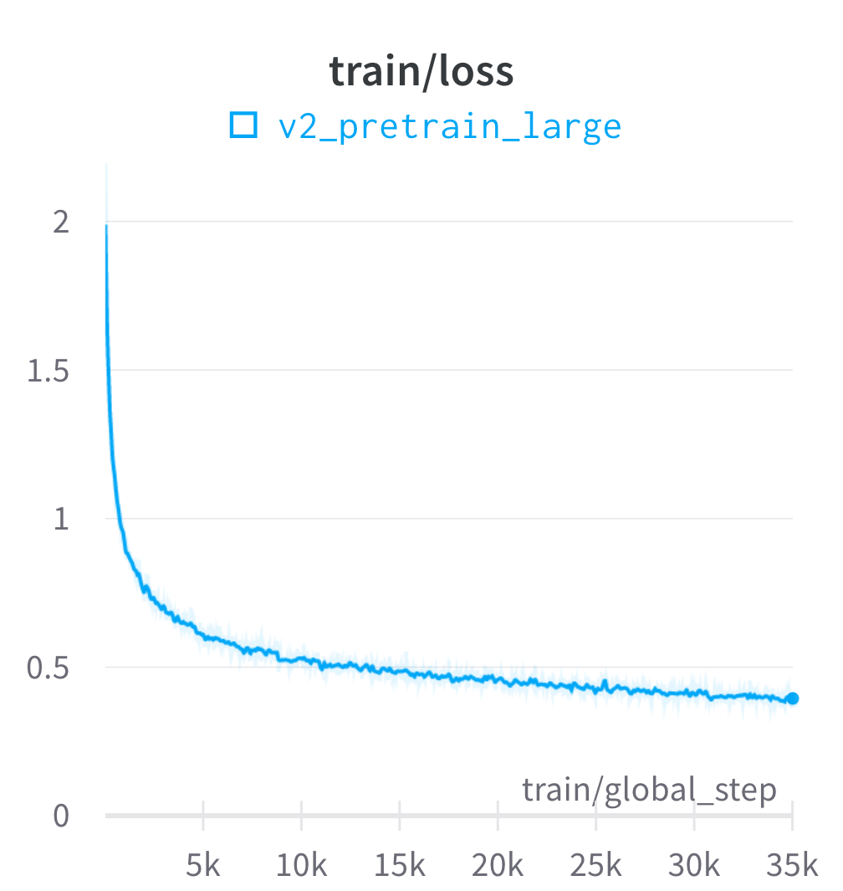
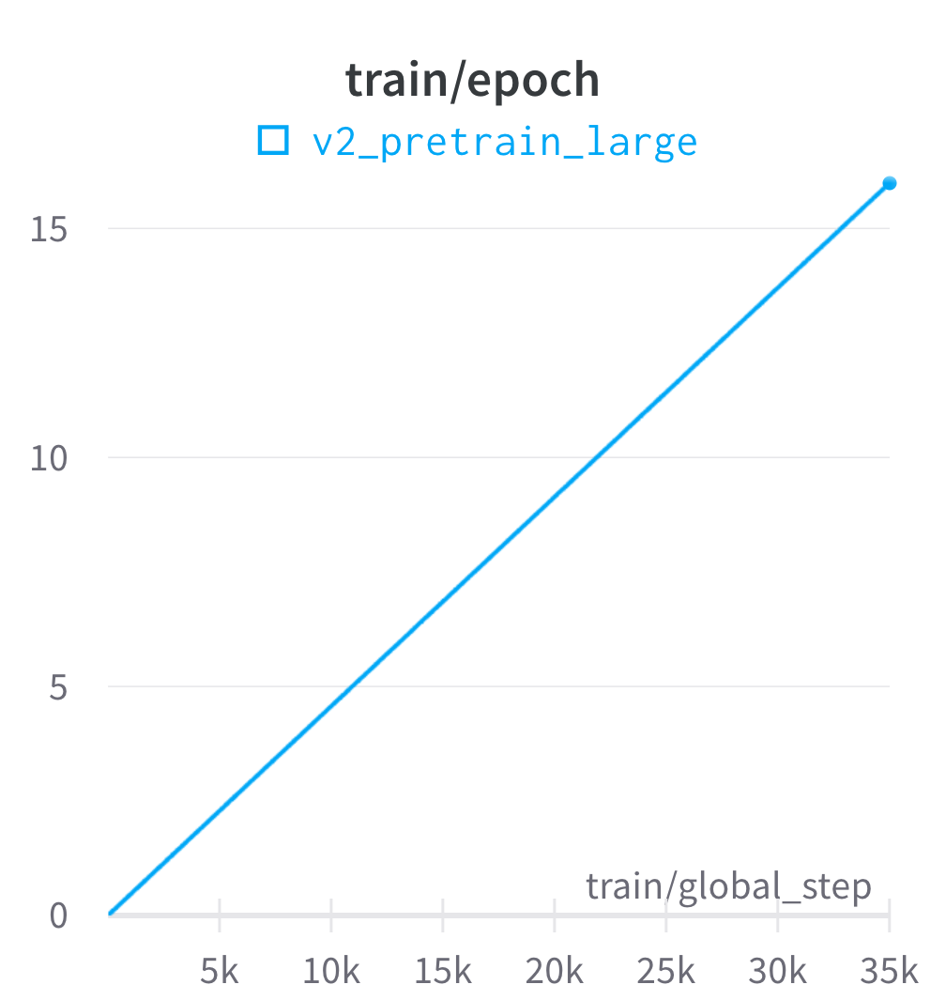
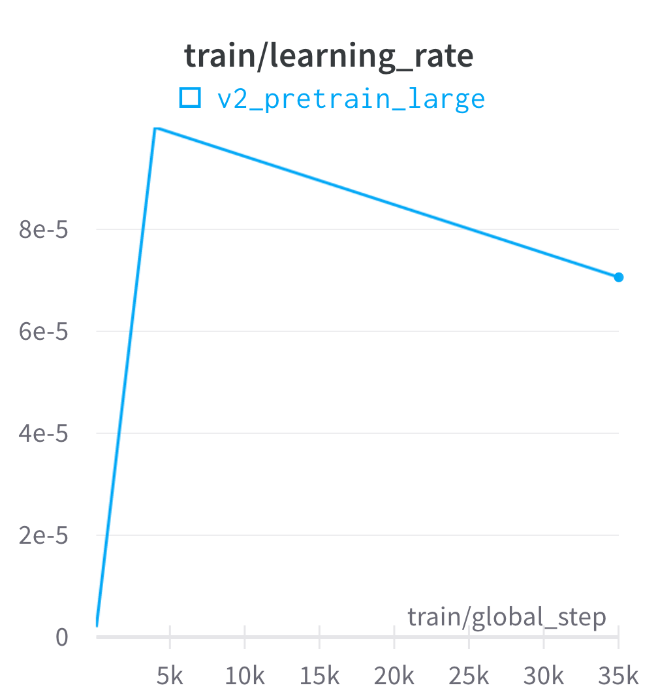
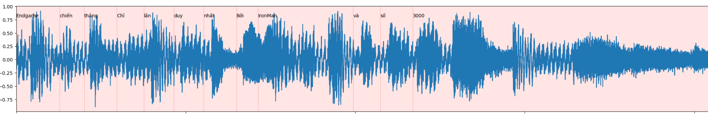

# Lyric alignment
Vietnamese song lyric alignment framework

## Task description (Zalo AI challenge 2022)

Many of us love to sing along with songs in the way of our favorite singers in albums (karaoke style). The target is building a model to align lyrics with a music audio.

- Input: a music segment (including vocal) and its lyrics.

- Output: start-time and end-time of each word in the lyrics.

For evaluation, the accuracy of prediction will be evaluated using Intersection over Union ($IoU$).
With $IoU$ metric, the higher the better. For example:



$IoU$ of prediction and the ground truth of an audio segment $S_i$ is computed by the following formula: 

> $IoU(S_i) = \frac{1}{m} \sum_{j=1}^{m}{\frac{G_j\cap P_j}{G_j\cup P_j}}$

where $m$ is the number of tokens of $S_i$. Then the Final IoU of across all $n$ audio segments is the average of their corresponding $IoU$: 

> $Final\_IoU = \frac{1}{n} \sum_{i=1}^{n}{IoU(S_i)}$

## Data description

### Zalo public dataset

- Training data: 1057 music segments from ~ 480 songs. Each segment is provided with an audio formatted as WAV file and a ground-truth JSON file which includes lyrics and aligned time frame (in milliseconds) of each single word.

- Testing data: 
    - Public test: 264 music segments from ~ 120 songs.

    - Private test: 464 music segments from ~ 200 songs.

An example of data:



### Crawling public dataset

Since the dataset provided by Zalo is small and noisy, we decided to crawl data from other public sources. Luckily, our strategies (detail in **Methodology** section) for this task do not need an aligned time frame for every single word but only the song and its lyric, just like a typical ASR dataset.

We detail data crawling and processing in the [data_preparation](./data_preparation/README.md) folder. We crawled a total of 30.000 songs from https://zingmp3.vn website, that around 1.500 hours of audio.

## Methodology

Our strategies are heavily based on the study of [CTC-Segmentation](https://arxiv.org/abs/2007.09127) by Ludwig Kürzinger and Pytorch tutorial of [Forced Alignment with Wav2Vec2](https://pytorch.org/audio/main/tutorials/forced_alignment_tutorial.html). Quote from Ludwig Kürzinger's study:

> CTC-segmentation, an algorithm to extract proper audio-text alignments in the presence of additional unknown speech sections at the beginning or end of the audio recording. It uses a CTC-based end to-end network that was trained on already aligned data beforehand, e.g., as provided by a CTC/attention ASR system.

Based on Pytorch tutorial of [Forced Alignment with Wav2Vec2](https://pytorch.org/audio/main/tutorials/forced_alignment_tutorial.html). The process of alignment looks like the following:

1. Estimate the frame-wise label probability from audio waveform

2. Generate the trellis matrix which represents the probability of labels aligned at time step.

3. Find the most likely path from the trellis matrix.


The alignment only works well if either having good frame-wise probability and the correct label. 

- A good frame-wise probability can be achieved from a robust acoustic model. Our setup's acoustic model is based on wav2vec2 architecture trained using CTC loss.

- A correct label mean the spoken form label. Because of lyric came from diverse of source, it can  include special characters, mix English and Vietnamese word, number format (date, time, currency,...), nickname, ... This kind of data will make the model hard to map between audio signal and text lyric. Our soulution is mapping all word of lyric from written form to spoken form. For example:

    | Written                                           | Spoken      |
    |--------------------------------------------------|--------------|
    | joker | giốc cơ |
    | running                  | răn ninh    |
    | 0h   | không giờ   |

    To convert English words to pronunciation way in Vietnamese, we use [nguyenvulebinh/spelling-oov](
    https://huggingface.co/nguyenvulebinh/spelling-oov) model. For handling number format, we use [Vinorm](https://github.com/v-nhandt21/Vinorm). For other special characters ".,?...", we delete it.

    The final time alignment of a written word (e.g. 0h) is a concatenated time alignment of its spoken words (e.g. không giờ).

## Evaluation setup

### Acoustic model

Our final model is based on [nguyenvulebinh/wav2vec2-large-vi-vlsp2020](https://huggingface.co/nguyenvulebinh/wav2vec2-large-vi-vlsp2020) model. It pre-trained on 13k hours of Vietnamese youtube audio (un-label data) and fine-tuned on 250 hours labeled of VLSP ASR dataset on 16kHz sampled speech audio. We used that checkpoint to train a new ASR model using 1.500 hours (prepared in previous steps). To preproduce our model from scratch, run the following command:

```bin/bash
CUDA_VISIBLE_DEVICES=0,1,2,3,4 python -m torch.distributed.launch --nproc_per_node 5 train.py
```

The *train.py* script will automatically download the dataset from huggingface [nguyenvulebinh/song_dataset](https://huggingface.co/datasets/nguyenvulebinh/song_dataset) and pre-trained model [nguyenvulebinh/wav2vec2-large-vi-vlsp2020](https://huggingface.co/nguyenvulebinh/wav2vec2-large-vi-vlsp2020) then do the training process.

In our experiment, we use 5 GPUs RTX A6000 (~250GB), batch size 160 - equivalent to 40 minutes per step. We train around 50 epochs, it takes 78 hours. Diagrams below show our log first 35k steps of training process. Final train loss is around 0.27.

<p float="left">
  
   
  
</p>


The performance WER of our model after training is as below:
- Zalo public dataset - test set:  0.2267
- Crawling public dataset - test set:  0.1427

### Alignment process

The alignment process has already been described in the methodology section. However, to achive our result on the public leaderboard $IoU = 0.632$, we need some addition steps. The detail is as follow:

1. The input will be format and convert to spoken form. Example the raw input:
    
    ```
    ['Endgame', 'chiến', 'thắng', 'Chỉ', 'lần', 'duy', 'nhất', 'Bởi', 'IronMan', 'và', 'số', '3000']
    ``` 

    The spoken form output will be:
    
    ```
    ['en gêm', 'chiến', 'thắng', 'chỉ', 'lần', 'duy', 'nhất', 'bởi', 'ai ron men', 'và', 'số', 'ba nghìn']
    ```

2. The spoken form text and the audio is force align by using CTC-Segmentation algorithm. Detail (3 steps) in the methodology section.

    ```
    output word_segments:
        en: 0 -> 140
        gêm: 200 -> 280
        chiến: 340 -> 440
        thắng: 521 -> 641
        chỉ: 761 -> 861
        lần: 961 -> 1042
        duy: 1182 -> 1262
        nhất: 1402 -> 1483
        bởi: 1643 -> 1703
        ai: 1803 -> 1863
        ron: 2064 -> 2144
        men: 2284 -> 2344
        và: 2505 -> 2565
        số: 2705 -> 2765
        ba: 2946 -> 2986
        nghìn: 3166 -> 3266
    ```

3. Based on the behavior of the labeled data provided by Zalo, we observe that the time frame of a consecutive word is consecutive. Therefore, from the word_segments output from the previous step, we align the time frame of each word as follows:

    ```python
    for i in range(len(word_segments) - 1):
        word = word_segments[i]
        next_word = word_segments[i + 1]
        word.end = next_word.start   
    ```

    However, we make some heuristic rules to make the output more accurate:

    - A word is not longer than 3s.
    - If word shorter than 1.4s / 140ms, we will add 20ms / 40ms to start and to the end of that word. We do that because data is hand labeling, human is easy to make error with a small segment.
    - All timestamps of each word shift to the left by 120ms. This rule makes a significant improvement in the IoU result; sometimes, it improves 10% absolute IoU value. This behavior we also observe from data, it is like when we do karaoke, we need the lyric appears a little sooner. We guess the labeler think like that when do labeling. In practice, we are not recommend to use this rule.

    All these heuristic rules are implemented in the function add_pad in the utils.py file.

    ```
    output after appying rules:
        en: 0 -> 100
        gêm: 60 -> 240
        chiến: 200 -> 420
        thắng: 380 -> 661
        chỉ: 621 -> 861
        lần: 821 -> 1082
        duy: 1042 -> 1302
        nhất: 1262 -> 1543
        bởi: 1503 -> 1703
        ai: 1663 -> 1964
        rừn: 1923 -> 2184
        mừn: 2144 -> 2404
        và: 2364 -> 2605
        số: 2565 -> 2845
        ba: 2805 -> 3066
        nghìn: 3046 -> 7274
    ```

4. Re align the spoken form to its raw word.

    ```
    Endgame ['en: 0 -> 100', 'gêm: 60 -> 240']
    chiến ['chiến: 200 -> 420']
    thắng ['thắng: 380 -> 661']
    Chỉ ['chỉ: 621 -> 861']
    lần ['lần: 821 -> 1082']
    duy ['duy: 1042 -> 1302']
    nhất ['nhất: 1262 -> 1543']
    Bởi ['bởi: 1503 -> 1703']
    IronMan ['ai: 1663 -> 1964', 'ron: 1923 -> 2184', 'men: 2144 -> 2404']
    và ['và: 2364 -> 2605']
    số ['số: 2565 -> 2845']
    3000 ['ba: 2805 -> 3066', 'nghìn: 3046 -> 7274']
    ```

    The final alignment result when drawing together with waveform looks like below:

    

## Usage

Our acoustic model has already uploaded to huggingface hub. The following code can be used to load this model:

```python
from transformers import AutoTokenizer, AutoFeatureExtractor
from model_handling import Wav2Vec2ForCTC

model_path = 'nguyenvulebinh/lyric-alignment'
model = Wav2Vec2ForCTC.from_pretrained(model_path).eval()
tokenizer = AutoTokenizer.from_pretrained(model_path)
feature_extractor = AutoFeatureExtractor.from_pretrained(model_path)
vocab = [tokenizer.convert_ids_to_tokens(i) for i in range(len(tokenizer.get_vocab()))]
```

The code for doing lyric alignment locate in the predict.py file. Be sure your audio file is 16kHz and single channel. You can use the preprocessing.py file to convert the audio file to ensure valid this requirement.

```python
from predict import handle_sample
import torchaudio
import json

# wav_path: path to audio file. Need to be 16k and single channel. 
# path_lyric: path to lyric data in json format, which includes list of segment and words
wav, _ = torchaudio.load(wav_path)
with open(path_lyric, 'r', encoding='utf-8') as file:
    lyric_data = json.load(file)
lyric_alignment = handle_sample(wav, lyric_data)
```

For example an input file 38303730395f313239.json in test set:

```json
[{"s": 0, "e": 0, "l": [{"s": 0, "e": 0, "d": "Endgame"}, {"s": 0, "e": 0, "d": "chiến"}, {"s": 0, "e": 0, "d": "thắng"}]}, {"s": 0, "e": 0, "l": [{"s": 0, "e": 0, "d": "Chỉ"}, {"s": 0, "e": 0, "d": "lần"}, {"s": 0, "e": 0, "d": "duy"}, {"s": 0, "e": 0, "d": "nhất"}]}, {"s": 0, "e": 0, "l": [{"s": 0, "e": 0, "d": "Bởi"}, {"s": 0, "e": 0, "d": "IronMan"}, {"s": 0, "e": 0, "d": "và"}, {"s": 0, "e": 0, "d": "số"}, {"s": 0, "e": 0, "d": "3000"}]}]
```

The lyric_alignment output will be:

```json
[{ "s": 0, "e": 661, "l": [ { "s": 0, "e": 240, "d": "Endgame" }, { "s": 200, "e": 420, "d": "chiến" }, { "s": 380, "e": 661, "d": "thắng" } ] }, { "s": 621, "e": 1543, "l": [ { "s": 621, "e": 861, "d": "Chỉ" }, { "s": 821, "e": 1082, "d": "lần" }, { "s": 1042, "e": 1302, "d": "duy" }, { "s": 1262, "e": 1543, "d": "nhất" } ] }, { "s": 1503, "e": 7274, "l": [ { "s": 1503, "e": 1703, "d": "Bởi" }, { "s": 1663, "e": 2404, "d": "IronMan" }, { "s": 2364, "e": 2605, "d": "và" }, { "s": 2565, "e": 2845, "d": "số" }, { "s": 2805, "e": 7274, "d": "3000" }]}]
```

## Acknowledgment

We want to thank the organizer of Zalo AI Challenge 2022 for this exciting challenge.

## Contact 

nguyenvulebinh@gmail.com 

[](https://twitter.com/intent/follow?screen_name=nguyenvulebinh)